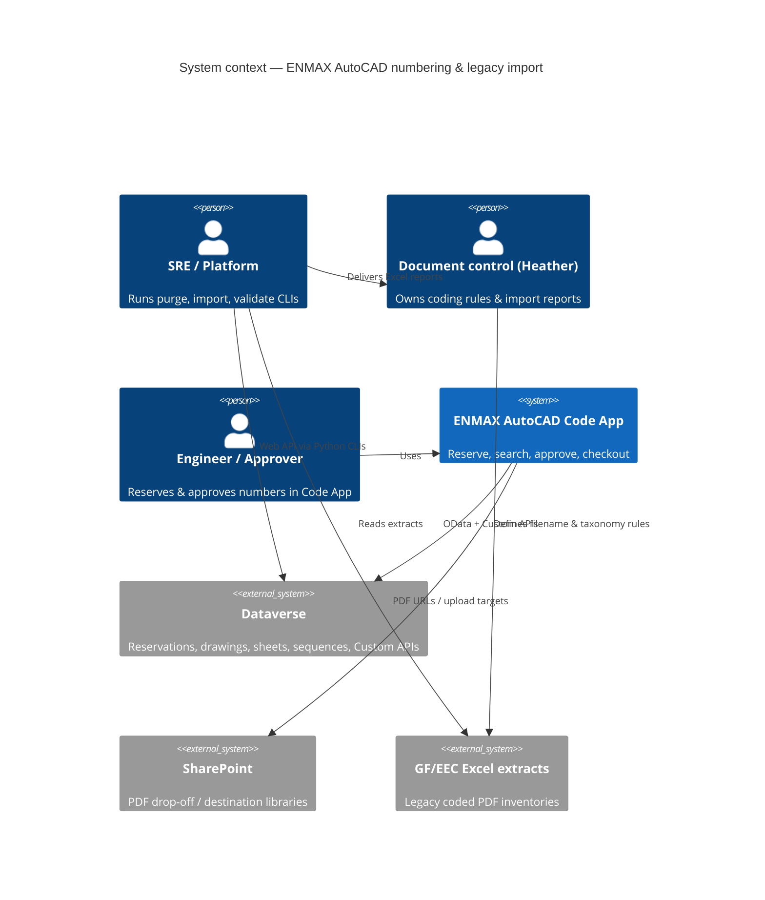
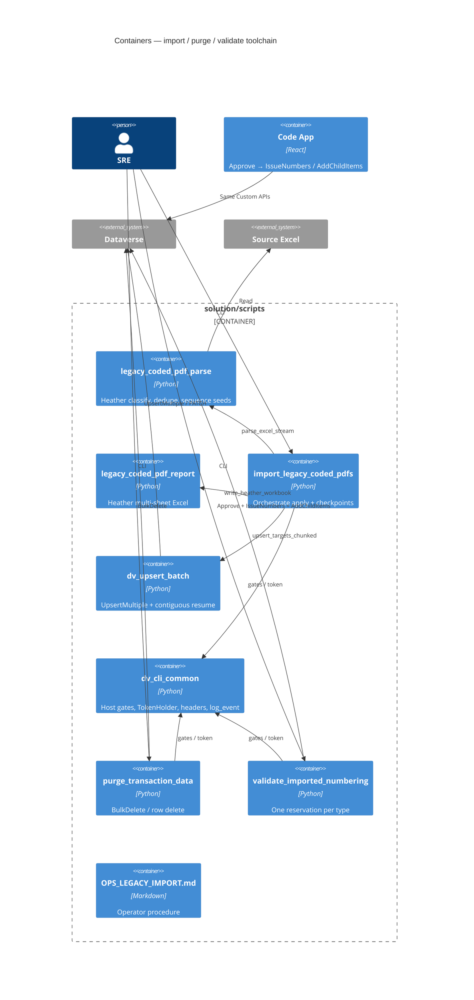
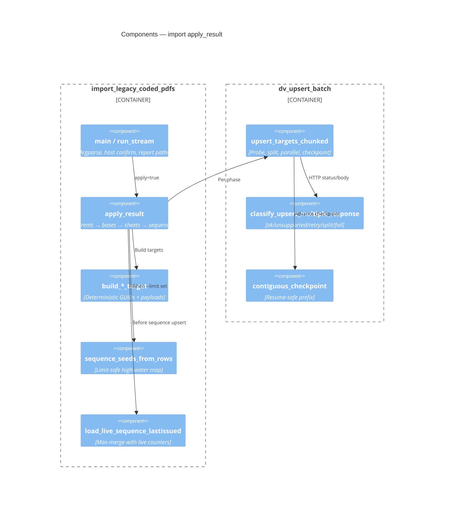
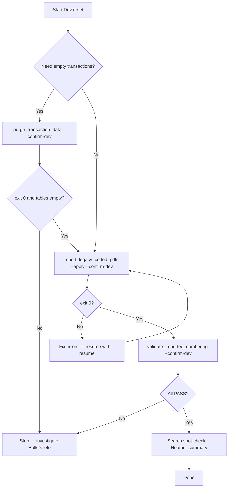
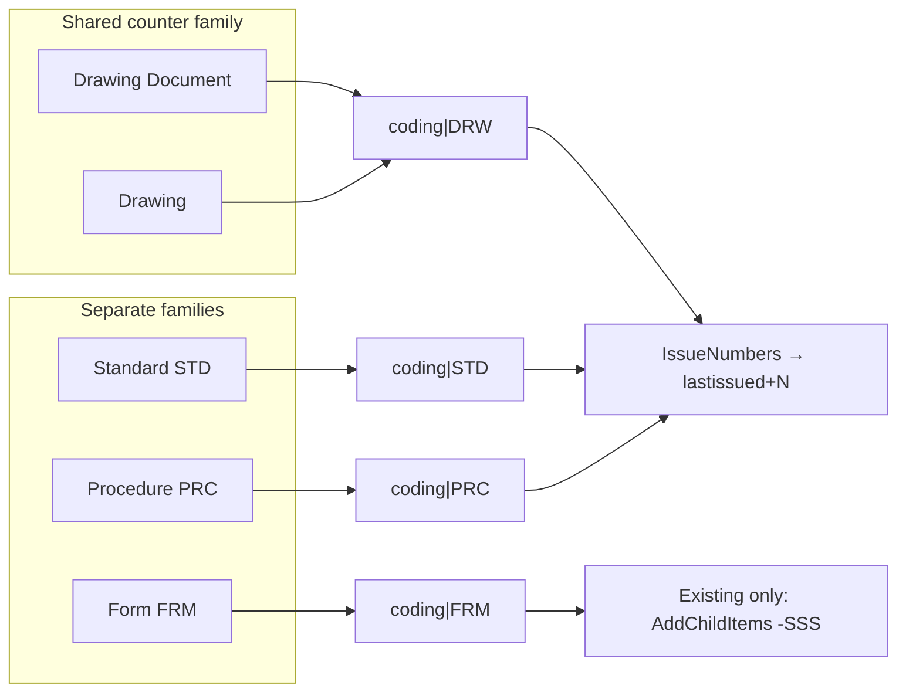
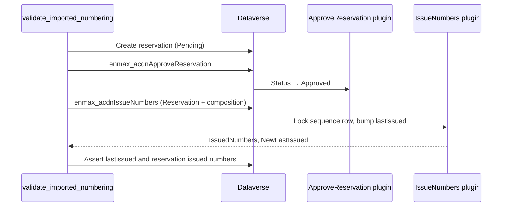
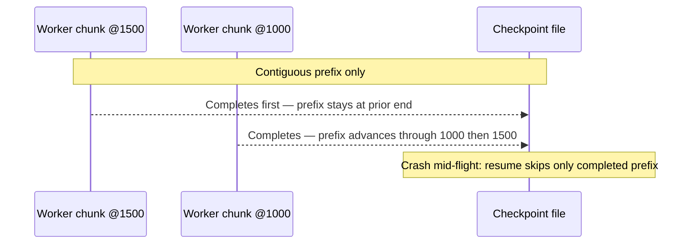

# Legacy import & numbering ops — architecture guide

Maintainer guide for humans and agents. Companion runbook: [`solution/scripts/OPS_LEGACY_IMPORT.md`](../solution/scripts/OPS_LEGACY_IMPORT.md).  
Numbering contract: [ADR 0001](adr/0001-document-numbering-model.md). Issuance is **never** client-side (CLAUDE.md Rule 14).

## Why this exists

Generation (GF) and EEC coded PDFs are bulk-loaded into Dataverse with high-water `enmax_acdnlastissued` counters so new reservations continue after import instead of restarting at `0001`. Operators must be able to purge, import, prove numbering, and brief Heather without tribal knowledge.

---

## C4 — System context (L1)

---

## C4 — Containers (L2)

---

## C4 — Components (L3) — import apply path

---

## Process — operator happy path

---

## Process — numbering families (ADR 0001)

---

## Sequence — validate one type (New)

Form Existing uses `enmax_acdnAddChildItems` instead of IssueNumbers; NNNN unchanged, `-SSS` advances.

---

## Sequence — import resume safety

---

## Data — entities touched

| Entity | Import | Purge | Validate |
|--------|--------|-------|----------|
| `enmax_autocaddrawing` | upsert bases/parents | delete | read Form base |
| `enmax_autocadsheet` | upsert sheets | delete | assert SSS |
| `enmax_autocadnumbersequence` | max-merge upsert | delete | assert lastissued |
| `enmax_autocadreservation` | — | delete | create/approve |
| Reference (Business…Kind) | read-only | **never** | read |

---

## Failure modes (SRE cheat sheet)

| Symptom | Likely cause | Action |
|---------|--------------|--------|
| Import exit 1, Heather GUIDs missing for a phase | Phase upsert errors | Fix API/auth; `--resume` |
| Numbers collide after smoke `--limit` | Old bug; fixed — seeds from applied rows | Re-import sequences with max-merge |
| Drawing NNNN restarts below history after import-without-purge | Pre-partition `coding` row ignored when seeding `coding\|DRW` | Fixed via `max_merge_sequence_seed`; still prefer purge-then-import |
| Purge “success” but rows remain | Sandbox BulkDelete | Re-run **without** `--sandbox` |
| 401 storms mid-run | Token refresh failed | Script should abort; re-auth `az login` |
| Form SSS wrong | AddChildItems not used | Validate must call AddChildItems for Existing Form |

---

## Agent notes

- Prefer editing `legacy_coded_pdf_parse.py` for Heather classify rules; do not put taxonomy in HTTP layer.
- Prefer `dv_upsert_batch.py` for concurrency/checkpoint changes.
- Prefer `dv_cli_common.py` for any new CLI that writes to Dataverse.
- Never invent next numbers in TypeScript — call Custom APIs.
- Reports under `solution/scripts/reports/` are gitignored — do not force-add.

---

## Search UI note

Search lists **Drawings** and **Documents** only. Reservation triage stays on Approvals / My Items. Shared `DocumentTypeBadge` maps Heather subtypes for display. This removal is intentional product cleanup from the thermos-approved Search simplification.

## Module map (quick)

| Module | Own when changing… |
|--------|--------------------|
| `legacy_coded_pdf_parse.py` | Filename rules, GF/EEC classify, dedupe |
| `legacy_coded_pdf_report.py` | Heather Excel sheets / email draft |
| `import_legacy_coded_pdfs.py` | CLI, apply orchestration, sequence max-merge |
| `dv_upsert_batch.py` | UpsertMultiple, resume checkpoints, workers |
| `dv_cli_common.py` | Host gates, tokens, `ENMAX_OPS_LOG=json` |
| `purge_transaction_data.py` | BulkDelete / row purge policy |
| `validate_imported_numbering.py` | Post-import numbering proof |
| `OPS_LEGACY_IMPORT.md` | Operator steps |
