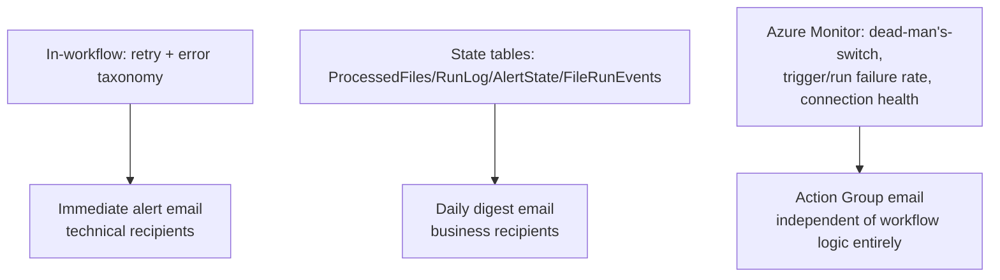

# Monitoring design

Three independent layers, deliberately non-overlapping in what they each
depend on — see [ADR-0011](../decisions/0011-three-layer-monitoring-architecture.md).

## Layer 1 — in-workflow

`wf-copy-invoices` classifies every failure into one of the 11 categories
in the [error taxonomy](../decisions/0019-error-taxonomy.md) and applies
the [retry/abandonment state machine](../decisions/0018-retry-abandonment-state-machine.md).
An immediate alert email fires on state transitions only — see
[alert suppression](../decisions/0020-alert-suppression-cooldown.md).

## Layer 2 — state tables

See [audit-trail.md](audit-trail.md) for the full table schema. These give
a durable, queryable record of what happened, independent of any single
run's transient success/failure — the digest emails are built entirely
from these tables, not from re-running anything.

## Layer 3 — Azure Monitor (platform-level, independent of the workflow entirely)

This layer exists specifically because a **dead** workflow cannot alert on
its own death — everything here evaluates metrics emitted by the platform
about the Logic App site, not anything the workflow itself writes.

| Alert | Metric | Threshold | Notes |
|---|---|---|---|
| Dead-man's-switch | `WorkflowRunsCompleted` | No successful run in 6h | Site-wide, deliberately **not** split by workflow — see [ADR-0021](../decisions/0021-deadmans-switch-threshold.md). |
| Trigger failures | `WorkflowTriggersFailureRate` | Any failure | Split by `workflowName` — [ADR-0012](../decisions/0012-alert-dimension-splitting.md). Typically indicates the gateway or file share is unreachable — the workflow never even starts. |
| Run failures | `WorkflowRunsFailureRate` | Any failure | Split by `workflowName`. Backstop for in-workflow error handling — fires on any run-level failure. |
| Connection health | (script-based, not a metric alert) | Daily | `Test-Connections.ps1` checks all three live connections (`filesystem-2`, `sharepointonline`, `office365`) report `Connected`. |

**Metric names matter here more than they might look** — the Consumption
Logic App metric names (`RunsSucceeded`, `TriggersFailed`, `RunsFailed`)
do **not exist** on `Microsoft.Web/sites` (Standard). The correct names,
confirmed against the live resource via
`az monitor metrics list-definitions`, are `WorkflowRunsCompleted`,
`WorkflowTriggersCompleted`, `WorkflowRunsFailureRate`,
`WorkflowTriggersFailureRate`. See [ADR-0011](../decisions/0011-three-layer-monitoring-architecture.md)
for the full story of why this was caught before it shipped.

**No per-action dimension exists** on any of these site-level metrics —
"which action failed" is not achievable via native Azure Monitor alerts at
all, only "which workflow" (via the `workflowName` dimension). If
per-action detail in the alert email itself is ever required, the
documented path is a custom Action-Group webhook target workflow that
looks up the failed run and sends a branded email — considered and
deliberately deferred, not built (see [ADR-0012](../decisions/0012-alert-dimension-splitting.md)).

All three alert rules route through a single Action Group, email-only —
no Teams/ITSM integration exists today (a documented future extension
point, not a current gap).
