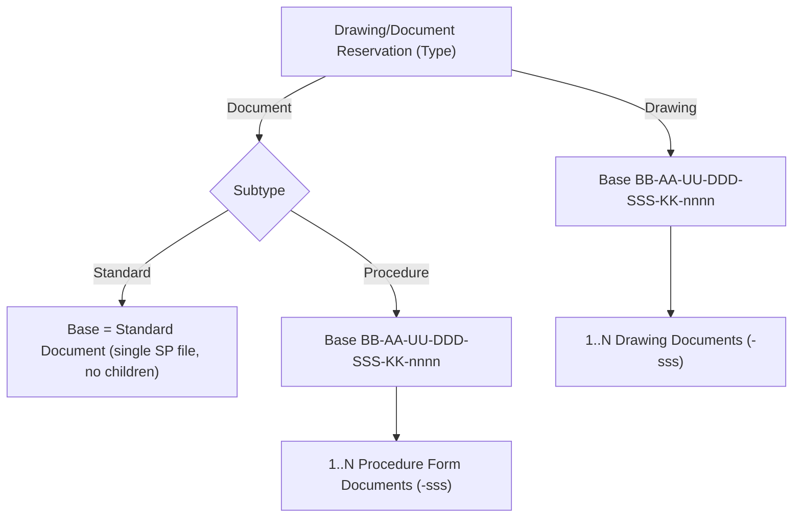

# EEC Generation Document Management system

Re-alignment of the ENMAX AutoCAD numbering app into a broader Drawing/Document management system, per your 15-item batch. Confirmed decisions: Check Out now requires approval (new queue); the child suffix stays 3 digits (`-sss`, max 999).

## Target domain model (items 1-7)

- A **Drawing/Document Reservation** carries a **Type**: `Drawing` or `Document`. If `Document`, a **Subtype**: `Standard` or `Procedure`. Type/subtype is shown prominently and persisted on the reservation.
- **Base number** = `BB-AA-UU-DDD-SSS-KK-nnnn` (six independent reference codes + a 4-digit sequence). Referred to everywhere as the **"Drawing/Document Number"**.
- **Drawing** -> base + 1..N children `…-nnnn-sss`; each child is a **"Drawing Document"** (the term "Sheet" is retired).
- **Document / Standard** -> the base itself is a **"Standard Document"** with a single SharePoint file named `BB-AA-UU-DDD-SSS-KK-nnnn` (no suffix, no children).
- **Document / Procedure** -> base + 1..N children `…-nnnn-sss`; each child is a **"Procedure Form Document"**, uploaded to SharePoint as one file per child (`BB-AA-UU-DDD-SSS-KK-nnnn-sss`).
- **SharePoint file association:** exactly one file per addressable record - a Drawing Document (`-nnnn-sss`), a Procedure Form Document (`-nnnn-sss`), or a Standard Document (base `-nnnn`, no suffix). Child files live on the child row ([enmax_autocadsheet](/Users/rahulnakmol/Developer/Projects/enmax-autocad/solution/src/Entities/enmax_autocadsheet/Entity.xml), holding the SharePoint URL); the Standard file lives on the base row (`enmax_autocaddrawing`). **Each record carries two SharePoint links** - a drop-off (working) URL and a destination (final) URL; see the SharePoint architecture section.
- **Children default to 1**, hard-capped at **999** (the 3-digit `sss` ceiling) - no app setting; the existing `MaxSheetsPerDrawing` config key is retired.

## SharePoint architecture (two sites, drop-off + destination)

- **Two separate SharePoint sites** - a **Drawings** site and a **Documents** site (Standards + Procedures). Site selection follows the reservation Type.
- **Two libraries per site:** a **drop-off** library (users **read/write**) where working files are uploaded during Check Out, and a **destination** library (users **read-only**) organized with a **1-level folder per vendor/project**, holding the final checked-in files.
- **Move-then-approve:** on Check Out the user works against the drop-off library; on Check In submit (with mandatory submission info incl. project/vendor), Heather **manually moves** the file(s) into the destination vendor/project folder, then the approver approves and the destination link is finalized on the record.
- **Two links per record (the tricky part):** each Drawing Document / Procedure Form Document / Standard Document can carry a **drop-off URL** (working copy) and a **destination URL** (final copy). The app surfaces both and lets the user open either. The checkout is an **advisory, non-enforced lock** represented by Dataverse checkout state, not a SharePoint lock.
- **Data model:** add a second URL column so each record holds both URLs (child row `enmax_autocadsheet` for Drawing/Procedure children; base `enmax_autocaddrawing` for Standard).
- **Config (no provisioning):** the two sites and their four libraries **already exist** - the app does not create or manage them. Their base URLs (Drawings drop-off + destination, Documents drop-off + destination) are supplied via **App Configuration** (Code-App-readable), not hard-coded (**CLAUDE.md Rule 15**: the Code App reads config from the App Configuration table, never Dataverse env vars). **Confirmed provisioned:** the drop-off/destination libraries, the RW/RO + per-user "My files" permission model, vendor/project folders, and **library versioning** are already set up - no provisioning work in scope.
- **Destination capture (confirmed - auto-index, folder-agnostic):** the destination folder is a vendor- or project-named 1-level folder, but the app does **not** manage or compute it. After the manual move, the app finds the file by its deterministic filename **across all folders** (SharePoint Search REST) and records the direct link.
- **PDF-only + in-browser preview:** all files are PDFs. Both the drop-off and destination links point **directly to the PDF** and open in an in-browser preview (SharePoint / Office Online PDF viewer, e.g. `?web=1` or the Graph/SharePoint preview endpoint) rather than forcing a download.

## SharePoint indexer and in-app upload (all low-code)

- **Indexer (background refresh):** a **scheduled Power Automate cloud flow** enumerates both libraries (drop-off + destination) across all folders via the **SharePoint connector**, matches PDFs to records by deterministic filename, and upserts **minimal Dataverse metadata** per record - drop-off URL, destination URL, present-in-drop-off flag, present-in-destination flag, last-indexed-at. Idempotent. An admin **Refresh index** is a manually/button-triggered run of the same flow; a lighter per-record refresh serves users.
- **CI/CD posture:** flows live in the solution (`solution/src/Workflows/*/definition.json`), so they are source-controlled and deploy through the existing pipeline - CI/CD is preserved without any pro-code infra.
- **No Azure / external infra.** Per the low-code constraint there is **no Azure Function** and no custom-connector relay. In-solution C# plugins / Custom APIs are still permitted, so the indexer flow upserts via the **Dataverse connector**, optionally calling a small Custom API for validated, testable writes (default: flow + Custom API for the upsert).
- **In-app upload (low-code, native):** preferred = a modal hosting the drop-off library's **native SharePoint UI** scoped to a **My files** view (filtered `Created By = [Me]`) so the user sees only their own files; SharePoint handles the ~100MB upload natively (no custom chunking), and the indexer links it to the record. Fallback if iframing is blocked by CSP `frame-ancestors` = open the same **My files** view in a new tab (still native SharePoint). No custom chunked uploader.
- **Notify:** on upload completion the app/flow records the drop-off URL and notifies admins + approvers (reusing the existing notification writer). Coexists with direct SharePoint-UI uploads (the indexer reconciles those).

## Structural decisions (ADR 0001)

- **Low-code constraint (overriding).** The rule is **no new external/Azure infra**. Everything stays Power Platform-native: Power Automate cloud flows, connectors (SharePoint, Office 365, Dataverse), Dataverse, the embedded SharePoint UI, the Code App, and in-solution C# plugins / Custom APIs (existing plugins - including numbering - may be extended). No Azure Functions or external services. The concurrency-safe number issuance stays a C# Dataverse plugin because a low-code flow cannot guarantee no duplicate numbers (PRD s9; **CLAUDE.md Rule 14**).
- **Combination tables dropped from reservation (item 1, the first realignment):** the six dropdowns become fully independent - all active values, no cascade, no Approved BB-AA / Asset-Unit / System-scope checks. The soft-validation "override + reason" fields become moot and are removed from the flow. Combination tables/data are **kept read-only** for historical rows (not deprecated) and no longer gate reservation.
- **Keep Dataverse schema names, change display + UI labels.** Physically renaming `enmax_autocadsheet` / `enmax_autocadreservation` schema names would break relationships, forms, generated services and plugins. We relabel display names ("Document Item"/"Drawing Document"/"Procedure Form Document"; "Drawing/Document Reservation") and derive the user-facing child label from the parent Type.
- **Type-aware issuance on one path.** The C# plugin path is authoritative; the legacy `On_Reservation_Approved_Issue_Drawings` Cloud Flow is retired/aligned. Issuance creates children only for Drawing/Procedure; Standard is base-only. Two sequences: base `nnnn` (per 6-segment coding, existing `enmax_autocadnumbersequence`) and child `sss` (per base). The optimistic-lock concurrency guard in [IssueNumbersPlugin.cs](/Users/rahulnakmol/Developer/Projects/enmax-autocad/solution/plugins/IssueNumbers/IssueNumbersPlugin.cs) is preserved and re-tested.
- **Base number is type-agnostic per coding (locked).** For a given 6-segment coding, `nnnn` is a single shared sequence, so a base `BB-AA-UU-DDD-SSS-KK-nnnn` belongs to exactly one reservation regardless of Type (Drawing / Standard / Procedure). No Type partition in `enmax_autocadnumbersequence`; base numbers are globally unique across types. (Follows the user's framing that a base "is either a document or a drawing".)
- **Check Out becomes an approved action (item 8).** A new Check Out approval step + queue is added next to the existing Check In approval, for all document types.
- **SharePoint topology.** Two sites (Drawings; Documents), each with a read/write drop-off library and a read-only destination library (1-level vendor/project folders); records store both a drop-off and a destination link; checkout is an advisory (non-enforced) lock via Dataverse state; the four library base URLs live in App Config (sites/libraries pre-exist; the app does not provision them). Files are PDF-only, located by deterministic filename regardless of folder, and opened via in-browser PDF preview. (Detailed in the SharePoint architecture section.)
- **SharePoint indexer + uploads (low-code).** A scheduled Power Automate flow (SharePoint connector) refreshes drop-off/destination link metadata into Dataverse; admin on-demand refresh via a triggerable flow; source-controlled in the solution for CI/CD. In-app upload via an embedded SharePoint 'My files' view (native, ~100MB) with a new-tab fallback if iframing is blocked. No Azure Function; numbering issuance remains the sole C# plugin exception.

## Risks and mitigations (from architectural review)

- **Filename determinism vs. native upload (known open gap).** The link/index model matches files by name `BB-AA-UU-DDD-SSS-KK-nnnn[-sss].pdf`, but native SharePoint upload lets users name files freely. Decision: the indexer **links only matching files; non-matching files are ignored** (no reconciliation queue, no hard rename enforcement for now). Users are guided to the deterministic name; robust enforcement is deferred and tracked as an open gap.
- **Indexer freshness / eventual consistency.** A scheduled flow lags reality, and SharePoint **Search** REST has its own indexing latency and can miss brand-new files. Mitigation: prefer **connector list** operations over Search; add **event-triggered** refresh (on upload complete, on approve) plus per-record on-demand refresh; the indexer reads **metadata only** (never downloads the ~100MB content).
- **Check Out approval ordering (locked: gated).** The drop-off working window opens **only after Check Out approval**: `request -> approver approves -> checked out (upload enabled) -> Check In submit -> Heather moves -> approver approves Check In`. The interim "checkout requested" state blocks upload and is surfaced in the UI. Two approval queues raise approver load (operational, accepted).
- **Zero combination validation -> data-quality drift.** Independent dropdowns (user-mandated) remove all guardrails, so nonsensical codings become possible. Accepted; mitigate with anomaly/consistency reporting in Phase 3 rather than re-adding checks.
- **Embedded SharePoint iframe likely CSP-blocked.** Treat the embed as an enhancement; build the guaranteed **new-tab** path first.
- **Rollout / reversibility.** Additive schema (optionsets + columns) is safe and lands first with zero behavior change; behavior changes (issuance, dropdowns) sit behind app-config flags with the golden numbering tests as the merge gate.
- **Licensing (confirmed handled).** Premium licensing for the Power Automate connectors and Phase 3 Power BI is already in place; no licensing blocker.

## Project guidance and source docs (authoritative)

Layered under `000-architecture-core` and **`enmax-autocad/CLAUDE.md`** (project rules 1-15), every agent also follows the project's own playbook and specs, which live on the orphan **`specs`** branch (accessed via a worktree: `git worktree add .worktrees/specs specs`, then `.worktrees/specs/docs/superpowers/...`).

- **CLAUDE.md rules that bind this plan:**
  - **Rule 14 (concurrency-safe issuance):** issuance only via the Dataverse custom action + plug-in; never from the client or a non-transactional flow; a concurrent-request test firing N parallel calls and asserting N distinct numbers is mandatory. Basis for WS0/WS1 and the "numbering stays a C# plugin" low-code exception.
  - **Rule 15 (Code Apps can't read env vars):** the Code App reads all config from the **App Configuration table** (SharePoint URLs, `ShowFinalizeButton`/`ShowObsoleteButton`); Power Automate flows may use environment variables. Basis for the App-Config decisions.
  - **Rule 6 (token budgets):** per-task 4,000 / per-session 30,000; summarize + start fresh at the cap and surface the breach - reinforces fresh-subagent-per-task.
  - **Rule 13 (don't spiral):** hard debug caps (2 repeats / 5 min classify / 15 min fix / 30 min task); read the build-trap docs before debugging frontend/deploy (per CLAUDE.md; locate on the `specs`/`runbooks` branch).
  - **Rules 1-4, 8-12:** think-before-coding, simplicity, surgical changes, read-before-write, tests-encode-intent, checkpoint, match-conventions, fail-loud - enforced by the reviewer and the loop-exit gates.
- **Required reading by workstream (`specs` branch):**
  - All: `docs/superpowers/specs/PRD-and-Architecture.md`, `docs/superpowers/specs/2026-05-18-architecture-review.md`, `docs/superpowers/playbook/naming-conventions.md`.
  - WS0/WS1: `docs/superpowers/playbook/plugins-and-custom-apis.md`, `docs/superpowers/playbook/dataverse-foundation.md`.
  - WS2/WS4 (UI): `docs/superpowers/playbook/code-apps.md`, `docs/superpowers/specs/_assets/design/design.md`, branding at `docs/superpowers/specs/_assets/design/branding/` (ENX logos), and legacy-UI screens at `docs/superpowers/specs/_assets/legacy-ui/` - the Opus 4.8 UI agent uses these for the flourish.
  - WS3/WS5: `docs/superpowers/playbook/power-automate-flows.md`, `docs/superpowers/playbook/security-roles-bu-teams.md`.
  - CI/CD + deploy: `docs/superpowers/playbook/deployment-and-cicd.md`, `docs/superpowers/plans/2026-05-26-powerplatform-deploy-module.md`.
- **Plan location (convention conflict surfaced, Rule 7).** CLAUDE.md keeps durable plans at `docs/superpowers/plans/` on the `specs` branch (existing sequence runs to plan-13). This working plan lives in `.cursor/plans/`. Decision: keep iterating here during planning, then **mirror the finalized plan to `docs/superpowers/plans/2026-07-06-plan-14-eec-generation-doc-management.md` on `specs`** as the first execution step, continuing the numbered sequence.

## Workstreams and key touchpoints

### 0 - ADR + safety net - Track A (Composer 2.5 implementer + Sonnet 5 reviewers)

- **Touchpoints:** ADR 0001 (above) + characterization/golden tests pinning current Drawing number output ([IssueNumbers.Tests](/Users/rahulnakmol/Developer/Projects/enmax-autocad/solution/plugins/IssueNumbers.Tests), client preview) before any refactor.
- **Acceptance criteria:** ADR 0001 committed under `docs/adr/`; golden tests capture the current Drawing base + child output and the client preview string for a fixed input set; the existing concurrency test runs green; all new tests run in CI; zero production behavior changed in this WS.
- **Business value:** Makes the risky numbering refactor safe and reversible - regressions are caught automatically, protecting the authoritative numbering the whole business depends on.
- **UI flourish:** None - backend/test only.
- **Loop exit:** spec review + code-quality review approved; business-value assessor confirms the safety net covers the numbering contract.

### 1 - Data model + numbering engine (server) - Track A (Composer 2.5 implementer + Sonnet 5 reviewers)

- **Touchpoints:** New optionsets `enmax_acdn_reservationtype`, `enmax_acdn_documentsubtype`; columns on [enmax_autocadreservation/Entity.xml](/Users/rahulnakmol/Developer/Projects/enmax-autocad/solution/src/Entities/enmax_autocadreservation/Entity.xml); retire `enmax_acdn_recordtypechoice`. Type-aware refactor of [AutoCreateDrawingsPlugin.cs](/Users/rahulnakmol/Developer/Projects/enmax-autocad/solution/plugins/IssueNumbers/AutoCreateDrawingsPlugin.cs) / [CreateDrawingsPlugin.cs](/Users/rahulnakmol/Developer/Projects/enmax-autocad/solution/plugins/IssueNumbers/CreateDrawingsPlugin.cs); add child `sss` sequence (hard cap 999, no config; retire the `MaxSheetsPerDrawing` key); Standard file URL on [enmax_autocaddrawing/Entity.xml](/Users/rahulnakmol/Developer/Projects/enmax-autocad/solution/src/Entities/enmax_autocaddrawing/Entity.xml); "Add to existing" custom API; retire/align the Cloud Flow.
- **Acceptance criteria:**
  - New optionsets + reservation columns deploy **additively**; existing rows unaffected; golden tests still green.
  - Issuance is type-aware: Drawing & Procedure create `-sss` children (default 1, hard cap 999, 3-digit), Standard is base-only; base `nnnn` is **type-agnostic per coding** and never duplicates under the concurrency test.
  - **No** combination/cascade checks remain in issuance; `MaxSheetsPerDrawing` removed.
  - "Add to existing" continues the child sequence (Drawing/Procedure) or issues the next base (Standard) correctly.
  - The legacy `On_Reservation_Approved_Issue_Drawings` Cloud Flow no longer issues numbers (single authoritative path).
- **Business value:** Unlocks the core goal - one engine numbering Drawings, Standards and Procedures correctly and without duplicates - replacing hard-coded drawing-only logic.
- **UI flourish:** None - server only.
- **Loop exit:** golden + concurrency + new per-type unit tests green; spec + code-quality review approved; business-value assessor confirms all three document types issue as specified.

### 2 - Reserve wizard (frontend) - Track A (Composer 2.5 logic + Opus 4.8 UI)

- **Touchpoints:** Type/Subtype step replacing [Step1RecordType.tsx](/Users/rahulnakmol/Developer/Projects/enmax-autocad/apps/code-app/src/features/reserve/steps/Step1RecordType.tsx); independent dropdowns in [Step2Composition.tsx](/Users/rahulnakmol/Developer/Projects/enmax-autocad/apps/code-app/src/features/reserve/steps/Step2Composition.tsx) (drop cascade + [useApprovedCombinations.ts](/Users/rahulnakmol/Developer/Projects/enmax-autocad/apps/code-app/src/features/reserve/hooks/useApprovedCombinations.ts) filters); New/Existing branch; relabel preview in [usePreviewNumber.ts](/Users/rahulnakmol/Developer/Projects/enmax-autocad/apps/code-app/src/features/reserve/hooks/usePreviewNumber.ts); update [schema.ts](/Users/rahulnakmol/Developer/Projects/enmax-autocad/apps/code-app/src/features/reserve/schema.ts) (type/subtype, drop override).
- **Acceptance criteria:**
  - Step 1 selects Reservation Type (Drawing/Document) and, for Document, Subtype (Standard/Procedure).
  - All six dropdowns show every active value with **no** cascade/dependency; any combination is selectable.
  - New vs Existing branch works: Existing lets the user enter a coding and pick a matching base to add to.
  - Live preview renders the correct pattern per type (`...-nnnn` or `...-nnnn-sss`); child-count input respects default 1 / cap 999.
  - Zod schema validates type/subtype; override/reason fields removed; submit issues via the WS1 path.
- **Business value:** The primary user journey - reserving a number - now covers all document types with far less friction (no forced combinations); the day-one adoption driver.
- **UI flourish (Opus 4.8):** Clean multi-step wizard with clear Type/Subtype selection cards; keyboard + screen-reader accessible; inline validation; a prominent live number preview; responsive layout with smooth step transitions; consistent Fluent v9 tokens; polished empty/loading/error states.
- **Loop exit:** logic reviewed by Sonnet 5 reviewers; Opus 4.8 UI pass meets the flourish bar; business-value assessor confirms the reserve flow is intuitive for all types.

### 3 - Check Out / Check In workflow - Track D (Composer 2.5 logic + Opus 4.8 UI)

- **Touchpoints:** New Check Out approval (plugin + flow + notification + queue in [ApprovalsPage.tsx](/Users/rahulnakmol/Developer/Projects/enmax-autocad/apps/code-app/src/features/approvals/ApprovalsPage.tsx)). Check In: mandatory Submission Information text; remove revision from [SubmitRevisionDrawer.tsx](/Users/rahulnakmol/Developer/Projects/enmax-autocad/apps/code-app/src/features/checkout/components/SubmitRevisionDrawer.tsx) and [SubmitRevisionPlugin.cs](/Users/rahulnakmol/Developer/Projects/enmax-autocad/solution/plugins/IssueNumbers/SubmitRevisionPlugin.cs). Drop-off vs destination links surfaced in Search / [DrawingDetailPanel.tsx](/Users/rahulnakmol/Developer/Projects/enmax-autocad/apps/code-app/src/features/search/DrawingDetailPanel.tsx).
- **Acceptance criteria:**
  - Check Out requires approval: request -> approver approves -> checked out; interim "checkout requested" state is visible; advisory Dataverse lock set; **drop-off upload is enabled only in the approved-checkout state** (the interim requested state blocks it).
  - Check In requires a mandatory Submission Information field (Project, WO#, etc.); revision number fully removed from UI + plugin; SharePoint **version history** is the revision trail (re-submits overwrite the same file).
  - Each record surfaces both drop-off and destination links; both open a PDF preview.
  - New Check Out approval queue appears in Approvals with notifications; audit events on every state change.
- **Business value:** Enforces governance (nothing checked out or in without approval) and captures submission context for traceability/audit - core to a controlled document system.
- **UI flourish (Opus 4.8):** Approval queues with clear status chips; a friendly, validated Submission Information form; obvious dual-link affordances (drop-off vs destination) with preview; consistent two-word Check In / Check Out labelling.
- **Loop exit:** approval + submission logic reviewed; Opus 4.8 UI pass approved; business-value assessor confirms the governance flow is enforceable and clear to approvers.

### 4 - UX, terminology, config (items 9, 11, 12, 13, 14, 15) - Track B (Opus 4.8 UI + Composer 2.5 logic)

- **Touchpoints:** App rename in [README.md](/Users/rahulnakmol/Developer/Projects/enmax-autocad/README.md), [package.json](/Users/rahulnakmol/Developer/Projects/enmax-autocad/package.json), [apps/code-app/package.json](/Users/rahulnakmol/Developer/Projects/enmax-autocad/apps/code-app/package.json), header/footer. Home reorder/relabel + View-All fix in [features/home](/Users/rahulnakmol/Developer/Projects/enmax-autocad/apps/code-app/src/features/home) / [MyItemsPage.tsx](/Users/rahulnakmol/Developer/Projects/enmax-autocad/apps/code-app/src/features/myitems/MyItemsPage.tsx). Approvals search + CSV export via [csvExport.ts](/Users/rahulnakmol/Developer/Projects/enmax-autocad/apps/code-app/src/components/DataGrid/csvExport.ts) / [EnmaxDataGrid.tsx](/Users/rahulnakmol/Developer/Projects/enmax-autocad/apps/code-app/src/components/DataGrid/EnmaxDataGrid.tsx). Config flags in [AppConfigSchema.ts](/Users/rahulnakmol/Developer/Projects/enmax-autocad/apps/code-app/src/config/AppConfigSchema.ts) + [app_config.yaml](/Users/rahulnakmol/Developer/Projects/enmax-autocad/solution/seed/app_config.yaml), consumed in [DrawingActionsPanel.tsx](/Users/rahulnakmol/Developer/Projects/enmax-autocad/apps/code-app/src/features/checkout/components/DrawingActionsPanel.tsx).
- **Acceptance criteria:**
  - App renamed to "EEC Generation Document Management system" everywhere (title, header/footer, package metadata, README).
  - Home: cards reordered/relabelled per item 12; "My Open Check outs" View All routes to My Reservations > My Checked Out Drawings.
  - Approvals: Requestor + Drawing/Document Number search on Pending / Approved / Rejected / Check-ins tabs.
  - CSV export on every grid, available to **all users**.
  - `ShowFinalizeButton` / `ShowObsoleteButton` default false and honored in the actions panel.
  - "Check In" / "Check Out" (two-word) and "Drawing/Document Reservation" / "Drawing/Document Number" labels applied throughout, including audit sentences.
- **Business value:** Makes the product feel purpose-built and self-service (correct naming, findable data, exportable reports, safe default-off actions) - directly improving adoption and reducing support load.
- **UI flourish (Opus 4.8, flagship):** Pixel-aligned cards and grids; consistent spacing/typography via Fluent tokens; accessible search inputs with clear affordances; tidy export/download buttons; responsive Home layout; coherent iconography and hover/focus states. This is the primary "flourish" workstream.
- **Loop exit:** Opus 4.8 owns and implements the visual fixes to the flourish bar; Sonnet 5 reviewers approve logic (config, CSV, routing); business-value assessor signs off on naming/consistency and self-service reporting.

### 5 - SharePoint indexer + in-app upload (low-code) - Track C (Composer 2.5 implementer + Sonnet 5 reviewers)

- Background indexer = scheduled Power Automate flow (SharePoint connector, **list ops not Search**, **metadata-only reads**) upserting drop-off/destination link metadata into Dataverse; **event-triggered** refresh on in-app upload/approve **+ a ~15 min scheduled sweep to catch native SharePoint-UI drops** + admin and per-record on-demand Refresh; **unmatched files are ignored** (not linked); minimal metadata columns on the record. Source-controlled in `solution/src/Workflows` for CI/CD.
- Upload to drop-off via a modal embedding the SharePoint 'My files' view (native, ~100MB); **new-tab path built first, embed as enhancement**; the upload entry point is **enabled only when the user holds an approved Check Out** on the record; users are **guided to the deterministic filename** (matching files are linked, non-matching ignored - known gap, no hard enforcement yet); notify admins/approvers on completion.
- No Azure Function / external infra; the number-issuance plugin remains the sole C# exception.
- **Library + link test harness (two layers):**
  - **Unit (CI, .NET):** the filename->record matcher + URL/flag derivation lives in the Custom API as pure logic and is unit-tested in [IssueNumbers.Tests](/Users/rahulnakmol/Developer/Projects/enmax-autocad/solution/plugins/IssueNumbers.Tests) - base `nnnn` (Standard) vs child `-sss`, folder-agnostic match across vendor/project subfolders, near-miss non-matches (e.g. `-001` vs `-010`), `.pdf`/case handling, and idempotent upsert decisions. No SharePoint needed.
  - **Integration (on-demand, low-code):** manually-triggered **Seed** and **Teardown** Power Automate flows create/delete **~1KB empty placeholder PDFs** (a minimal *valid* PDF byte stream so the in-browser preview path still works) with deterministic names across the four libraries (incl. destination vendor/project subfolders); a **Validate** flow (or test runner) runs the indexer, then asserts each record's drop-off/destination URLs + present flags against the expected scenario matrix and emits a pass/fail report.
  - **Scenario matrix:** drop-off only / destination only / both / neither; base (Standard) vs child (Drawing Document, Procedure Form Document); file in a vendor folder vs a project folder; deletion clears the flag; re-run is idempotent; both links open a PDF preview; a **misnamed/unmatched file is ignored** (not linked); a **re-submit overwrites** the same file (SharePoint version count increments) with the link unchanged; the **stale-until-reindex window** behaves correctly (event-triggered refresh closes it).
  - **Environment + CI (locked):** the integration layer targets the **UAT SharePoint site** as the dedicated test site (separate from the real prod Drawings/Documents sites); its URLs are supplied to the Seed/Validate/Teardown flows via test-scoped config/params. It runs **manually/on-demand** under the **ENMAX DEV** profile; only the .NET matcher unit tests run in CI (no service principal needed now). Seed/Teardown are test-only artifacts, not wired into prod.
- **Acceptance criteria:**
  - Scheduled + event-triggered flow upserts drop-off/destination URLs + present flags via connector **list** ops (metadata-only); idempotent; unmatched files ignored.
  - Admin and per-record on-demand Refresh work.
  - Upload path: new-tab "My files" works first; embed modal used where CSP allows; user sees only their own files; entry point enabled only for an **approved-checkout** record.
  - Re-submissions **overwrite the same filename** (library versioning ON), so the link stays stable and preview shows the current version.
  - A subtle **"no linked file found yet"** indicator surfaces when no matching file is present, so a mis-named upload isn't invisible (Rule 12 fail-loud).
  - Unit matcher tests pass in CI; the UAT integration harness (Seed/Validate/Teardown, ~1KB valid PDFs) passes the full scenario matrix on demand.
- **Business value:** Keeps Dataverse link metadata trustworthy so users always reach the right PDF (working or final) - the backbone of the two-site repository - with a repeatable harness proving it.
- **UI flourish (Opus 4.8, upload surfaces only):** a clean drag-drop/embed surface, clear drop-off vs destination link buttons with PDF-preview affordance, and graceful new-tab fallback messaging.
- **Loop exit:** matcher unit tests green in CI; harness scenario matrix passes on UAT; reviews approved; business-value assessor confirms link trustworthiness and upload usability.

### 6 - Data migration + backfill (additive) - Track A (Composer 2.5 implementer + Sonnet 5 reviewers)

- **Touchpoints:** Backfill existing [enmax_autocadreservation/Entity.xml](/Users/rahulnakmol/Developer/Projects/enmax-autocad/solution/src/Entities/enmax_autocadreservation/Entity.xml) rows to `Reservation Type = Drawing` (null subtype); existing [enmax_autocadsheet/Entity.xml](/Users/rahulnakmol/Developer/Projects/enmax-autocad/solution/src/Entities/enmax_autocadsheet/Entity.xml) rows present as **Drawing Documents**; seed the two new optionsets and reconcile `enmax_autocadrecordtype`; retire `enmax_acdn_recordtypechoice`; leave the second URL column null for the indexer to fill.
- **Acceptance criteria:** all existing reservations get Type=Drawing (null subtype); existing sheets present as Drawing Documents; optionsets seeded; `enmax_acdn_recordtypechoice` retired; second URL column present + null; indexer fills URLs on first run; migration re-runnable/idempotent; golden tests green; **no destructive renames**.
- **Business value:** Existing records keep working unchanged under the new model - zero data loss, no manual re-entry - essential for go-live acceptance.
- **UI flourish:** None - data only.
- **Loop exit:** dry-run on a copy verified; idempotent re-run confirmed; reviews approved; business-value assessor signs off that historical data resolves correctly.

### Phase 3 - Power BI reporting (last)

- **Touchpoints:** Separate Power BI workspace over the Dataverse connector (LCR Daily Report replacement + dashboards), link-out from the app.
- **Acceptance criteria:** workspace + datasets over Dataverse; LCR Daily Report reproduced; app link-out works; access controlled; licensing confirmed with IT; a coding-**anomaly** report surfaces odd combinations (compensating control for dropped validation).
- **Business value:** Turns controlled data into management insight (LCR replacement + dashboards) and provides the anomaly reporting that compensates for removed combination validation.
- **UI flourish (Opus 4.8):** link-out button/section styled consistently with the app; report visuals follow ENMAX branding where possible.
- **Loop exit:** report parity with the current LCR confirmed by the business-value assessor; licensing/access signed off with IT.

## Suggested execution order (parallel tracks)

Sequenced as a dependency DAG so independent tracks run as parallel agent loops:
- **Track A (critical path):** WS0 safety net -> WS1 additive schema/optionsets (zero-behavior) -> WS1 type-aware issuance -> WS2 reserve wizard -> WS6 backfill. Behavior sits behind app-config flags; golden tests gate every merge.
- **Track B (independent):** WS4 UX/rename/terminology/CSV/config - no dependency on numbering; can start immediately. UI-alignment/visual fixes here are **implemented by the Opus 4.8 beautifier**; Composer 2.5 handles the non-visual logic (config wiring, CSV export, data plumbing).
- **Track C (independent):** WS5 SharePoint indexer + upload + library/link harness - depends only on the two additive URL columns, not on numbering.
- **Track D (after schema):** WS3 Check Out/Check In workflow - needs the additive schema, not the numbering refactor.
- **Phase 3** (Power BI) last.

The orchestrator serializes within a track and parallelizes across tracks, resolving cross-track conflicts at integration.

## Multi-agent delivery model (loops)

Execution follows the **subagent-driven-development** pattern - fresh subagent per task, two-stage review (spec compliance -> code quality) - with a UI-polish pass and a business-value gate added for this engagement. Each workstream runs on its own feature branch in an isolated **git worktree** (never on `main` or `dev`); the orchestrator tracks state in TodoWrite and integrates only via **squash-merged PRs**. **Every role runs as a loop:** it iterates (implement / review / polish / assess -> feedback -> redo) until its gate passes, never a single pass; the orchestrator itself loops across tasks and tracks until the DAG is complete.

### Roles -> models
- **Orchestrator (Fable 5, `claude-fable-5-thinking-high`):** decomposes the plan into task specs + acceptance criteria, dispatches subagents, adjudicates reviews, runs the full gate, integrates, manages the track DAG; loops across tasks/tracks until done.
- **Implementer (Composer 2.5, `composer-2.5-fast`):** implements one task against its spec, writes/updates tests (TDD), builds + runs tests locally under the ENMAX DEV profile, self-reviews, commits (or returns NEEDS_CONTEXT / BLOCKED); loops on reviewer/assessor feedback until gates pass.
- **Spec + code-quality reviewer (Sonnet 5, `claude-sonnet-5-thinking-high`, separate fresh instance):** independent two-stage review by a more capable model; never the same instance that implemented; loops until approved.
- **Model note (thinking effort):** the only available Composer slug is `composer-2.5-fast` - no separate thinking-tier variant - so the Composer **implementer**'s effort is whatever that slug provides. The **reviewer** runs Sonnet 5 (`claude-sonnet-5-thinking-high`), an independent higher-reasoning check on Composer's output; the orchestrator can also escalate a hard implementation task to a more capable model (BLOCKED-handling rule).
- **UI beautifier / optimizer (Opus 4.8, `claude-opus-4-8-thinking-xhigh`):** on frontend tasks, polishes Fluent UI, accessibility, responsiveness, and performance (memoization, React Query caching, bundle). **All UI-alignment and visual fixes (layout, spacing, Fluent UI consistency, and the Home / Approvals / grid / rename UX items in WS4) are owned and implemented directly by this Opus 4.8 agent** - not just a post-pass over Composer's output; loops until the UX/perf bar is met.
- **Business-value assessor (Opus 4.8, `claude-opus-4-8-thinking-xhigh`):** scores each increment and milestone against PRD outcomes, adoption, migration, licensing, change-management (Heather's manual move), and KPIs; emits a business-ready sign-off **plus concrete fine-tune instructions** fed back to the implementer / UI beautifier to tighten business fit (loop), or a must-fix list.

### The loop (per task)
1. Orchestrator writes the task spec (full text + context + acceptance criteria + test requirements) and confirms the safety net exists.
2. Implementer implements + tests + self-reviews + commits **to the workstream feature branch (in its worktree)**.
3. Spec reviewer confirms code matches spec (no over/under-build); loop until pass.
4. Code-quality reviewer checks standards (000-architecture-core), security (no secrets, auth/audit flags), tests; loop until approved.
5. If UI in scope: UI beautifier refines; re-review.
6. Business-value assessor gates the increment; must-fix items loop back.
7. Orchestrator runs the full gate (golden + concurrency + lint + build), **opens a PR and squash-merges into `dev`**, marks the task complete; next task.

### Branching, worktrees, and PRs
- **Protected branches:** `main` (production) and `dev` (integration) are protected - **no direct commits or pushes**; every change lands through a PR.
- **Branch per workstream/task:** each workstream gets a feature branch off `dev` (e.g. `feat/ws1-numbering-engine`), checked out in its own **git worktree** so parallel tracks never collide.
- **Check-ins via PR:** the implementer commits to the feature branch inside the worktree; when the loop's gates pass, the orchestrator opens a PR into `dev`.
- **Squash-merge only:** PRs are **squash-merged** (one clean commit per workstream/task), then the branch + worktree are deleted.
- **Merge gate:** a PR merges only when CI is green (golden + concurrency + matcher unit + lint + build), spec + code-quality review are approved, and the business-value gate has signed off.
- **Release:** `dev -> main` is itself a squash-merged PR, cut at milestone boundaries after business-ready sign-off.
- **Parallelism:** independent tracks (A/B/C/D) run as concurrent worktrees; the orchestrator serializes only within a track and resolves cross-track conflicts at integration.

### Agent discipline (CLAUDE.md)
- **Token budgets (Rule 6):** per-task 4,000 / per-session 30,000; summarize + start fresh at the cap; surface breaches - never silently overrun. Reinforces fresh-subagent-per-task.
- **Anti-spiral (Rule 13):** stop after 2 near-identical failed attempts; caps: can't classify in 5 min / can't fix in 15 min / >30 min on one task -> surface with what was tried, the exact error, and the next hypothesis; read the build-trap docs before debugging frontend/deploy.
- **Fail loud + checkpoint (Rules 12, 10):** "done" only if nothing was skipped (skipped tests = not passing); each loop iteration summarizes done / verified / left before proceeding.
- **Conduct (Rules 1-3, 8, 11):** think-before-coding, simplicity, surgical changes, read-before-write, match existing conventions - the reviewer enforces these.

### Quality gates (merge blockers)
Golden Drawing-numbering tests unchanged; concurrency test green; lint + build clean; spec + code-quality approved; business-ready sign-off at milestone boundaries; feature-flag + rollback confirmed for behavior changes; all changes via **squash-merged PR into `dev`** (no direct commits to `main`/`dev`).

## Decisions locked in (previously open)

- **Check Out is gated:** the drop-off working window (upload) opens only after Check Out approval; the interim "checkout requested" state blocks upload.
- **Approver role:** the existing approver-role members can approve both the Check Out and Check In queues; no new role model needed.
- **SharePoint + licensing ready:** libraries, permissions, folders, versioning, and premium licensing are already provisioned - no setup work in scope.
- **Re-submission overwrites:** re-submitting a Drawing/Document number overwrites the same deterministic filename; prior versions live in **SharePoint version history** (library versioning must be ON). Since Check In dropped the revision number, version history is the revision trail; links stay stable (no versioned filenames).
- **Combination tables:** not deprecated - kept read-only for historical rows; they no longer gate reservation (dropdowns are independent).
- **CSV export:** enabled on all grids for **all users** (not admin-gated).
- **Build/deploy auth:** all `pac` build/deploy commands use the existing **ENMAX DEV** auth profile (`pac auth select --name "ENMAX DEV"`), UAT-style user credentials.
- **CI/CD auth caveat (flag):** the ENMAX DEV profile is interactive user credentials - fine for local/manual build + deploy, but the GitHub Actions pipeline needs **non-interactive** auth (service principal / federated credentials, secret held in a vault). Do not embed user credentials in CI; confirm the pipeline SPN separately.

## Testing and guardrails

Concurrency test stays the merge gate; golden tests prove Drawing numbering is unchanged for the Drawing path; per-type unit tests for Standard (base-only) and Procedure (children); the library+link harness (CI unit matcher tests + on-demand seed/validate/teardown flows) proves the indexer's drop-off/destination URL + presence-flag logic across the scenario matrix; audit events on every state change; no secrets in config; issuance-plugin changes keep the second-reviewer rule.